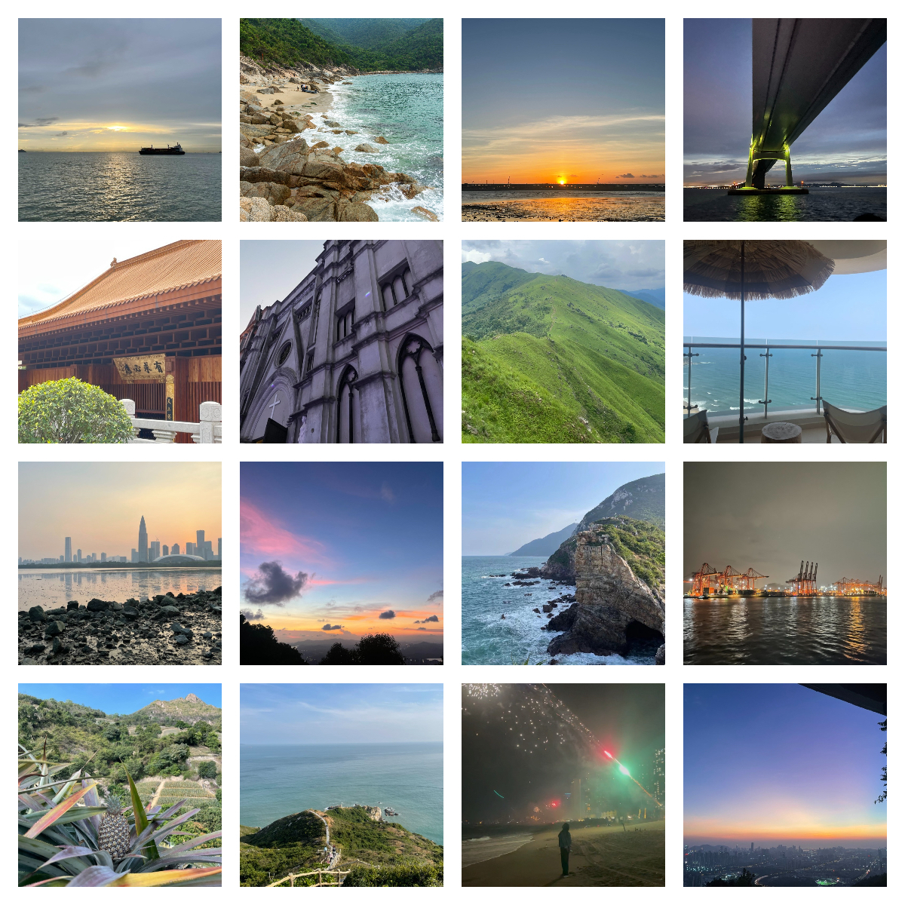

# README

现如今很多朋友都在珠三角地区工作，繁忙的工作日之后，周末的时候想出去走走，却不知要去哪里，看腻了周围的高楼大厦，想走远一点却不知从何下手。

frank作为一个在深圳工作的程序员，每天看够了电脑，几乎每个周末都会想着去外面放空一下自己，感受一下大自然。我在近一年的周末去了大湾区西部和东部的很多地方，近期也花了很多时间和新朋友一起徒步，发现其实大湾区附近有很多好玩的地方，在周末也可以玩的足够开心，并且花费也不会太大（大多就是大商圈吃1～2顿火锅的花费），还可以顺便锻炼一下身体。

我是一个体验派，出去玩最在意整体感受。这不仅取决于去的地方，还取决于季节、天气、住宿、交通、体力消耗、金钱消耗、跟谁一起去等等多个因素，作为一个程序员，我将尽力从多个角度来结构化的描述一次周末出游的体验和攻略，希望能给同在大湾区打工的朋友们在寻找快乐的路上多一点帮助～

除了“大湾区周末游”的专题，又新增了“离职后的远游”（走得比较远的旅途），以及“未完待续”（用于种草想去但还没去的、或者去了还没写完游记的）这两个专题，后续看情况可能还会分得更细hhh

感兴趣的朋友也可以加我的微信：frankkk96（人多的话会考虑拉一个微信群供大家交流和组队）

另外该项目还在持续更新中，如果有好的游玩计划也十分欢迎大家来提PR，项目地址：[https://github.com/frankkk96/gitbook-dawanqu-vacation](https://github.com/frankkk96/gitbook-dawanqu-vacation)

下面的图是我近一年出去玩随手拍的照片（都是iPhone12 mini原图）

<figure><figcaption>
最近看过的风景
</figcaption></figure>

其中包括：

* 坐游轮在海上看夕阳日落、从港珠澳大桥下穿过
* 在天文台栈道上看海
* 在种满了菠萝的山上徒步
* 在《美人鱼》拍摄地看人鱼洞
* 在海景民宿阳台上面朝大海、看海上日出
* 在夜晚的海边沙滩上吃烧烤、放烟花
* 在山顶看夕阳下的深圳城
* 徒步穿越武功山一样的高山草甸
* 坐在海景民宿的落地窗旁写代码
* 等等其他很多有趣的事情、好看的风景

