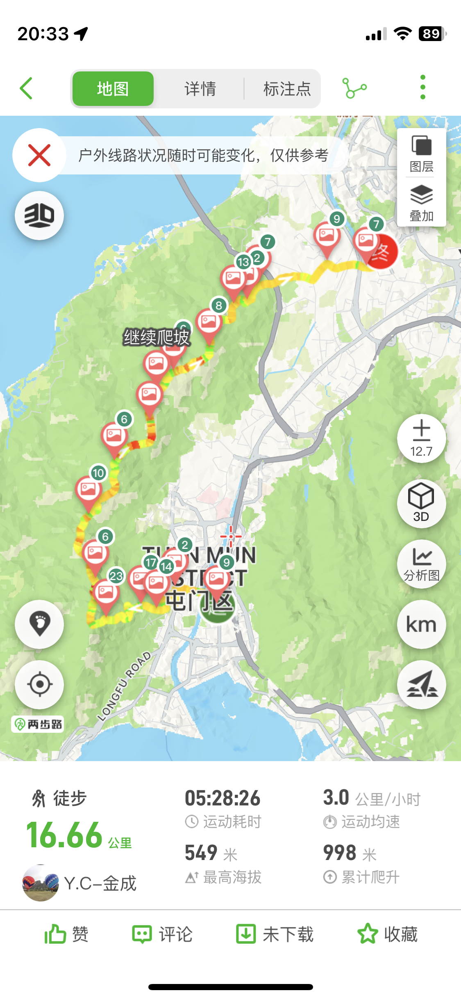
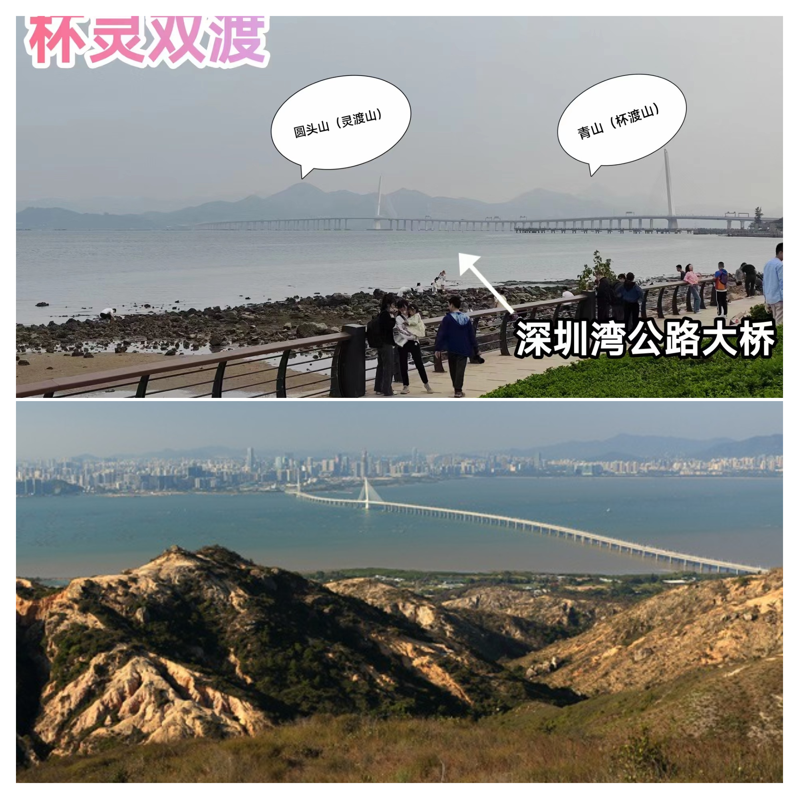

# 杯灵双渡---从对岸遥望深圳湾大桥

## 概况

地点：香港

* 时长：7小时左右
* 交通方式：从深圳湾口岸过关后坐香港巴士到登山口
* 消费参考：100以内（1人，交通+小吃）
* 体力消耗：中等
* 适合人群：有运动基础
* 季节与天气：推荐凉快的时候、日晒很容易中暑
* 主要体验点：挑战香港四大考牌线路、从对岸遥望深圳湾大桥

## 体验点

### 1、挑战香港四大考牌线路之一

杯灵双渡是香港行山四大考牌路径之一，指由青山（杯渡山）至圆头山（灵渡山）的行山路线1。全程约15公里，途中需穿梭于青山腹地的丘陵地带，体力和技术要求极高。

路线一般由屯门青山禅院起，先后跨越青山及圆头山，再下降至灵渡寺；又或由青山南脊上攀，再循以上路线下走至灵渡寺。由于路线的上落差大，所行走的都是受严重风化的崎岖山径，而且沿途都没有树荫，故杯灵双渡被视为一条难度甚高的路线。

我们是全程在雨中走完了这条路线，由于没有日晒其实还算轻松，身体脱水很少，全程两瓶水搞定，总体体验很棒，这里放几张照片供大家参考

<figure><figcaption>
除了第一个爬升，全程都差不多是这样的路线
</figcaption></figure>

从登山徒步的角度来看，杯灵双渡全程15km，爬升大约1000左右，强度不算太大，但路比较滑，还是适合有经验的人或跟着靠谱的领队前往（轨迹可两步路搜索：杯灵双渡）

<figure><figcaption>
总体强度不算太大
</figcaption></figure>

### 2、从对岸遥望深圳湾大桥

作为经常去深圳湾公园散步的人，总是遥望对岸的香港，在没去过之前总是想象着那边的世界是什么样的，在这次的路线中可以从反方向遥望到深圳湾，第一次从对岸往回看还是颇有感触的

<figure><figcaption>
第二张是网上找的晴天的图片
</figcaption></figure>

## 详细攻略

TODO
