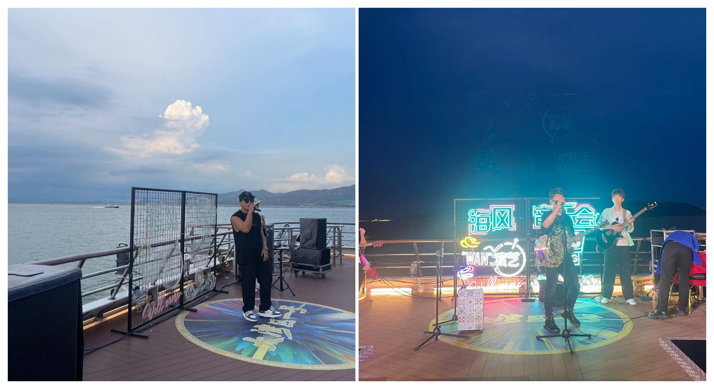
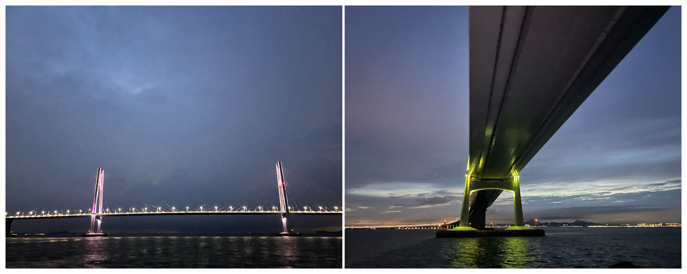
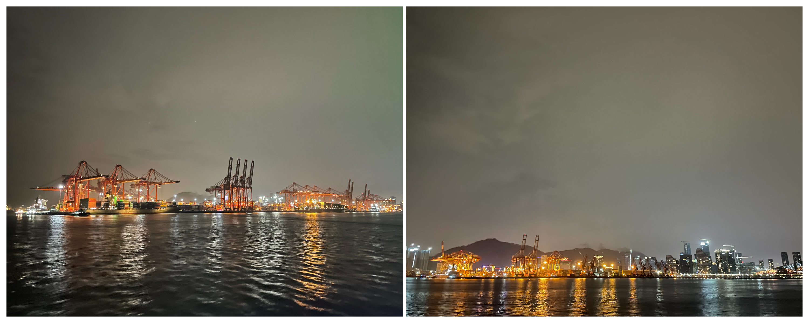

# 大湾区一号---游轮上听歌看海

## 概况

地点：蛇口邮轮母港

* 时长：4小时左右
* 交通方式：坐车到“蛇口邮轮母港”后上游轮，海上游结束之后游轮会返回原港口
* 消费参考：300左右（1人，交通+船票+小吃）
* 体力消耗：很休闲
* 适合人群：带娃，带老人，情侣均可
* 季节与天气：四季皆可，船上有空调，夏天有海风在甲板也不热，推荐下午6点的船票，可以同时看到白天、日落、夜景
* 主要体验点：海上日落、甲板上海风音乐会、船上魔术表演、穿越港珠澳大桥、蛇口港夜景

## 体验点

### 1、在海上看日落

坐游轮在海上看日落，和在公园看日落最大的区别在于船是运动的，景色是在不断变换的，日落的背景墙可以是海平面、一个小岛、一艘邮轮、甚至是港珠澳大桥，能够在一个地方同时体验到多种景色的感觉是无比快乐的

<figure><figcaption>
我去的两次云层都比较厚，没有看到很明显的日落，但是云层也很好看，右边两张是港珠澳大桥
</figcaption></figure>

### 2、甲板上的海风音乐会

海风音乐会其实就是甲板上的乐队表演，可以坐在露天甲板上，喝着啤酒看乐队演唱流行歌曲（周杰伦、五月天等等），很适合放松心情

<figure><figcaption>
无论是白天启程、或者是晚上的返航都有音乐
</figcaption></figure>

### 3、船上的魔术表演

本来对这个没有抱太大期待，但看过之后表示很惊艳（魔术师是某个比赛的冠军，很厉害），现场的氛围很好，值得一看（看得太入迷，忘记拍照片了。。。）

### 4、穿越港珠澳大桥

这个应该是游轮的主要卖点之一，在游轮到达港珠澳大桥附近时，工作人员会用广播提醒游客前往甲板，然后游轮从港珠澳大桥下缓缓穿桥而过，广播伴随着《歌唱祖国》作为背景音乐，对港珠澳大桥做详细的介绍，很适合带家里长辈来体验下，情怀拉满了

<figure><figcaption>
现场感受还是会很震撼
</figcaption></figure>

### 5、蛇口港夜景

返航回到蛇口港的时候已经是晚上，这时候港口的灯全部亮起来了，沿着返航的航线一路近观蛇口港的夜景也是很不错的体验

<figure><figcaption>
夜晚还繁忙的蛇口港
</figcaption></figure>

## 详细攻略

直接在携程或者公众号“招商游轮”上买“大湾区一号”的船票就好，个人推荐6点的船票，可以看到日落和夜景。登船的时候前往“蛇口邮轮母港”就好，到了之后往左手边走上二楼，找到取票的机器后取票进闸机就可以排队登船了
