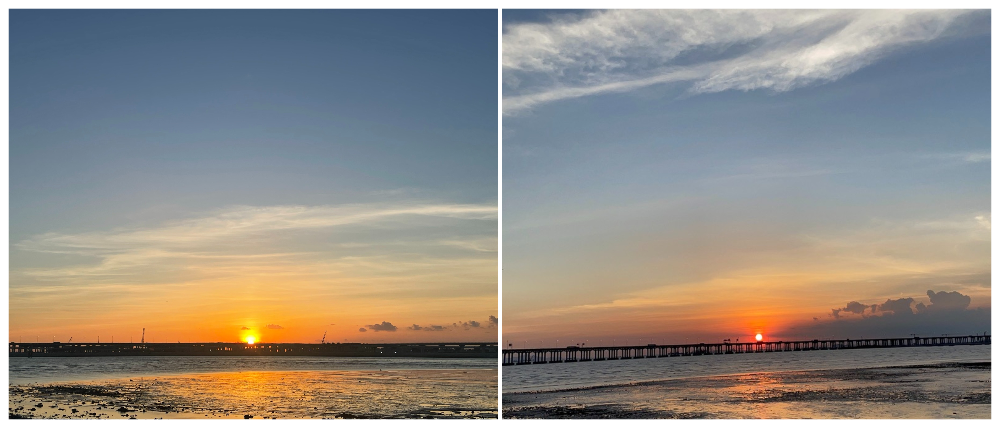

# 红树林公园---看太阳沉入海平面

## 概况

地点：深圳宝安西湾红树林公园

* 时长：2小时左右
* 交通方式：公交、打车、自驾均可
* 消费参考：100以内（1人，交通）
* 体力消耗：很休闲
* 适合人群：带娃，带老人，情侣均可
* 季节与天气：晴空万里的时候日落会更好看
* 主要体验点：海上的绝美日落

## 体验点

### 1、海上的绝美日落

宝安红树湾公园是深圳市区最佳日落观景点之一，透过广深沿江高速眺望远处的日落，拍出来的照片非常好看，这里有很多人带着单反来拍日落，放两张我用手机拍的日落。

<figure><figcaption>
两张是在不同时间地点拍的，这里的日落值得亲眼一见
</figcaption></figure>

## 详细攻略

建议先查一下当天的日落时间点（百度搜索深圳日落时间即可，很准确），然后预留时间直接导航到“宝安西湾红树林公园”即可，自驾的话这边也有很大的停车场，不用担心停车的问题。另外这边有很多路边小吃摊，可以买点小吃再去看日落，十分的舒服。
