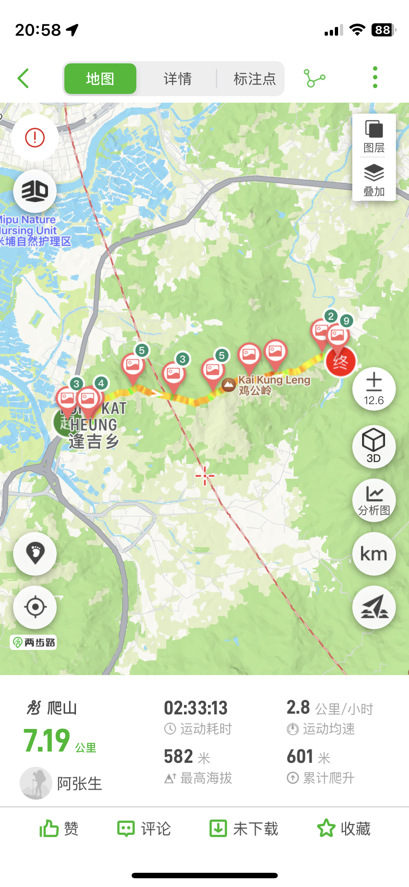
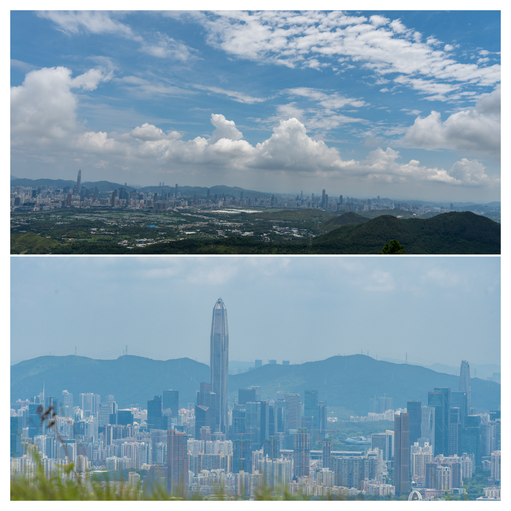

# 鸡公岭---武功山一样的高山草甸

## 概况

地点：香港

* 时长：5小时左右
* 交通方式：从福田口岸过关后坐香港小巴到登山口
* 消费参考：100左右（1人，交通+小吃）
* 体力消耗：中等
* 适合人群：有运动基础
* 季节与天气：7～9月凉爽的时候（这段季节草比较绿、日晒很容易中暑）
* 主要体验点：武功山一样的高山草甸、从对岸遥望深圳

## 体验点

### 1、武功山一样的高山草甸

鸡公岭的风景很像武功山，都是高山草甸，这里无须多言，放一些照片供大家参考下～

<figure><figcaption>
队友用单反拍的美照
</figcaption></figure>

从登山徒步的角度来看，鸡公岭全程7km，爬升大约600m左右，强度不算太大，比杯灵双渡简单许多，稍有运动基础都可以冲，但一定要注意防中暑（轨迹可两步路搜索：鸡公岭）

<figure><figcaption>
比较简单的一条路线
</figcaption></figure>

### 2、从对岸遥望深圳

和杯灵双渡一样，在鸡公岭上也能遥望对岸的深圳，平安大厦尤为显眼

<figure><figcaption></figcaption></figure>

## 详细攻略

### 需要提前准备的

* 港澳通行证+签证+香港流量包（淘宝直接买）+支付宝的香港乘车码+港币现金或八达通（香港小巴不能扫码支付）
* 登山鞋+登山杖+饮用水（建议带一瓶运动饮料，香港的比较贵建议在深圳买）
* 两步路app搜索“鸡公岭”，提前预习并将轨迹导入手机（[这条轨迹](https://www.2bulu.com/track/track\_detail.htm?trackId=nJV3Xd8l6Irp%2FR2KBg5Tzw%3D%3D)供参考）

### 行程安排

1. 在福田口岸过关后乘坐75路小巴，在“壆围”（壆音“勃”,粤语音【bok3】）下车，注意上车的时候跟司机说要在这里下车
2. 下车后在高德地图搜索“鸡公岭观景台”，步行约10分钟即可到达
3. 沿着提前导入的轨迹前行即可，下山后可高德导航坐公交地铁或打车回到福田口岸
