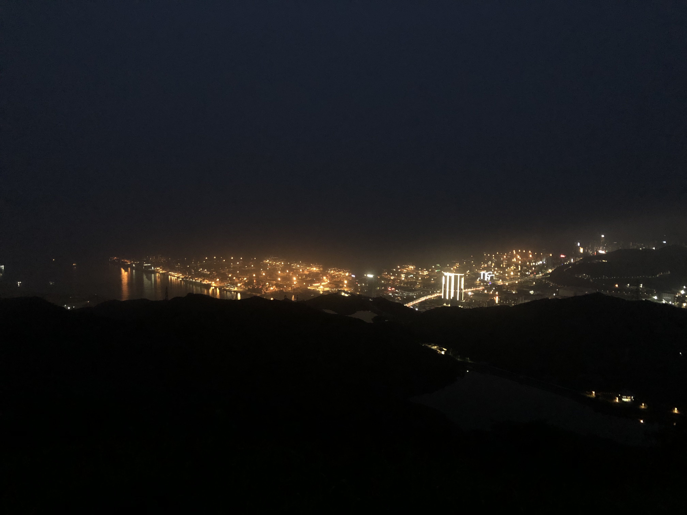

# 梅沙尖---俯瞰盐田港

## 概况

地点：深圳盐田

* 时长：5小时左右
* 交通方式：坐车到东部华侨城，然后从登山口上山往返
* 消费参考：100以内（1人，交通+小吃）
* 体力消耗：中等
* 适合人群：有运动基础的人
* 季节与天气：凉爽的季节（夏天容易中暑），晴空万里的天气（视野极好），夜晚可以看到盐田港夜景
* 主要体验点：盐田港夜景

## 体验点

### 1、盐田港夜景

我在白天和晚上都去过梅沙尖，白天的风景个人觉得比较平淡一点，中规中矩的感觉，并且天气也比较热，晚上的时候凉爽很多，在山顶看夜景的感觉也会更特别一些（在夜晚的山顶上，吹着海风登高望远的感觉很值得体验下），在夜里俯瞰盐田港也很好看

<figure><figcaption>
夜里繁忙的盐田港
</figcaption></figure>

## 详细攻略

TODO
