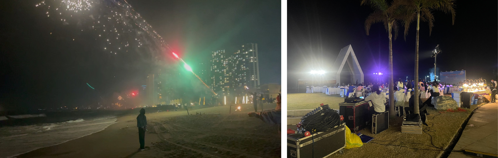

# 【双月湾】累了就来这里躺平看海

## 概况

* 地点：惠州双月湾
* 时长：两天一夜（深圳市区出发）
* 交通方式：高铁+打车（端到端2小时左右，深圳南山出发）
* 消费参考：1000左右（两人，交通+住宿+吃饭）
* 体力消耗：1星
* 适合人群：情侣出行+拍照、带老人小孩度假
* 季节与天气：夏天比较热和晒，建议避开暑期
* 主要体验点：民宿阳台看海上日出、沙滩放烟花+吃烧烤、便宜的海鲜等

## 体验点

### 1、在民宿阳台看海和日出

整个旅行中最喜欢的部分就是在民宿的阳台上看海了，买上零食和冰可乐，与身边的人坐在阳台的沙滩椅上看着下面的沙滩和一望无际的大海，海风将整个人的疲倦一扫而光，或许你会跟我一样，希望时间就定格于此了。更惊喜的是，在第二天醒来可以透过阳台看到从海平面升起的太阳，随着太阳从小亮点变成红日，周围的温度逐渐升高，天色也变亮了起来，不需要看手机就能感受到时间流动的感觉会让人流连忘返。

<figure><figcaption>
两张图都是在民宿阳台拍的
</figcaption></figure>

### 2、在沙滩放烟花+吃烧烤

在来这里之前，沙滩放烟花是我从未设想的，因为我的印象中景区海边不会允许这样的污染（但实际上双月湾的沙滩还是比较干净的）。我常觉得海边的夜晚应该是宁静的，在夜色中只会有海浪的声音，给人与世隔绝的错觉。但双月湾的沙滩是很热闹的，很多人在沙滩上嬉笑打闹，有放烟花的、撸串喝酒的、团建的等等，事实上夜晚沙滩上的市井感会让人有一种过春节的满足感，我相信很多人会和我一样，在那一瞬间会有“等有时间一定要带父母来一次”的想法。

<figure><figcaption>
左图是面向大海的大烟花，右图是一家公司的团建，在沙滩吃自助餐
</figcaption></figure>

### 3、观景台上遥望整个双月湾

在双月湾的时候偶然发现了这个观景台的存在，在登上山顶之后，终于明白为什么双月湾会叫双月湾，两侧的海岸线都像弯弯的月亮，中间只有一条狭长的通道。手机地图上可以清晰的看出来，但没想到在山顶也能同时将两轮弯月尽收眼底，属于旅行中的意外惊喜了。

<figure><figcaption>
左图是山顶拍的，右图是苹果地图上的形状
</figcaption></figure>

### 4、不太贵的海鲜（相比深圳）

由于双月湾附近海鲜餐厅实在太多，内卷严重，因此整体的价格相比深圳都会便宜不少。不过我没吃太多，海鲜质量也不太能品鉴出来，个人觉得还算实惠，放一个美团的团购大家感受一下。

<figure><figcaption>
这个套餐的团购价是66.8元。。。像这样的套餐美团还有很多
</figcaption></figure>

## 详细攻略

### 需要提前准备的

* 高铁票（惠东南站下，深圳北出发半小时到，二等座¥39）
* 民宿（双月湾东边看日出，西边看日落，看个人喜好预定，一般民宿会标注出来日出房，建议高楼层视野会更好，我们的日出房价格¥345供参考）

### 行程安排

* 周六上午
  * 早上从深圳北出发，坐高铁半小时到惠东南站，再打车到民宿（半小时多、约¥100），到达时约10:00
  * 一般这时候民宿还不能入住，将大件行李放前台后到楼下沙滩拍照玩耍，然后在附近找个海鲜餐厅吃饭，吃完饭约13:00，然后去民宿入住
* 周六下午
  * 夏天比较热，下午在民宿休息睡午觉，然后买点零食饮料在民宿阳台听音乐吹海风，约17:00左右出门打车去双月湾观景台（可以定位到海龟博物馆）
  * 下车后，坐摩的上观景台（来回两个人共¥50，自己走上去要半小时太久），看完风景后下山吃晚餐（注意这个时候会非常堵车，不要打车，建议直接坐摩的回市区吃饭，两个人¥40），吃完饭再回民宿楼下沙滩放烟花（沙滩有人卖，价格不贵），还可以吃点夜宵后再回民宿休息
* 周天
  * 早上起床看日出（可以百度查询当天日出时间点，然后定好闹钟），然后睡回笼觉，之后退房，约12:00
  * 退房后在附近餐厅吃饭，吃完直接打车去惠东南站坐高铁回深圳，到深圳约16:00

## 拓展体验

* 各种水上项目，看上去很好玩刺激，但是时间有限没有去（摩托艇，出海钓鱼，潜水等等）
* 海龟岛看海龟，由于时间关系去太晚了已经关门了没看到

