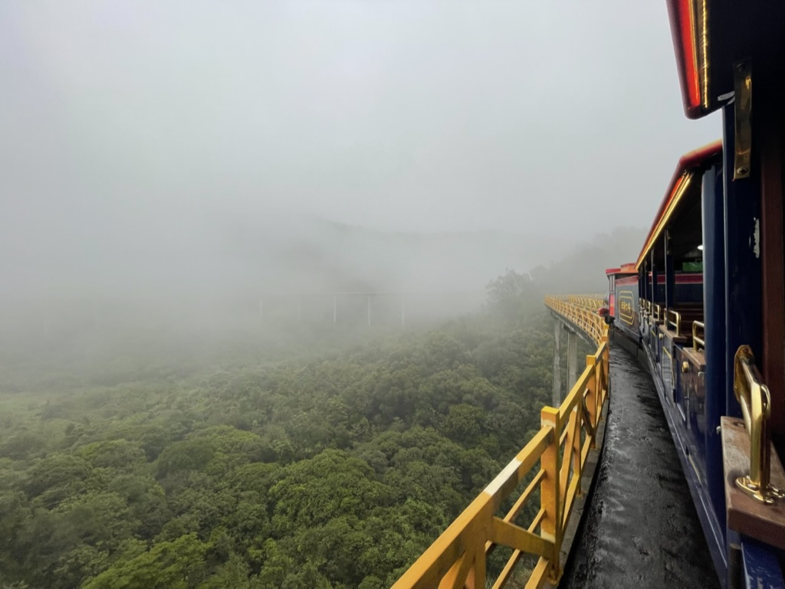
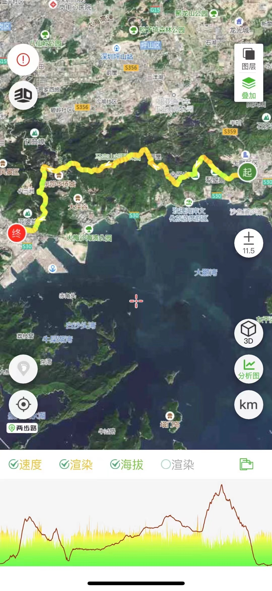

# 梅沙尖---俯瞰盐田港

之前概况

地点：深圳盐田

* 时长：5小时左右
* 交通方式：坐车到东部华侨城，然后从登山口上山往返
* 消费参考：100以内（1人，交通+小吃）
* 体力消耗：中等
* 适合人群：有运动基础的人
* 季节与天气：凉爽的季节（夏天容易中暑），晴空万里的天气（视野极好），夜晚可以看到盐田港夜景
* 主要体验点：盐田港夜景

## 体验点

### 1、盐田港夜景

我在白天和晚上都去过梅沙尖，白天的风景个人觉得比较平淡一点，中规中矩的感觉，并且天气也比较热，晚上的时候凉爽很多，在山顶看夜景的感觉也会更特别一些（在夜晚的山顶上，吹着海风登高望远的感觉很值得体验下），在夜里俯瞰盐田港也很好看

<figure><figcaption>
夜里繁忙的盐田港
</figcaption></figure>

## 详细攻略

1. 坐车、或开车前往“梅沙尖茶溪谷入口”，附近有停车场很方便
2. 沿着台阶上山即可
3. 下山原路返回起点

## 拓展体验

* 梅沙尖有很多登山口，茶溪谷只是其中一个（从半山腰上山顶，实际爬升只有一半海拔），其余的还有“山海大观登山口”，“北山路登山口”等，后续可以尝试不同的路线
* 据说山上的日出很好看，感兴趣的朋友可以来夜爬后看日出
* 茶溪谷入口旁边就是东部华侨城的小火车站点，有时间的话可以体验下小火车，还挺好玩的
* 更长的穿越路线（葵梅穿越）：可以从葵涌中心-->犁璧山-->马峦山-->东部华侨城-->梅沙尖这样横穿过来，全程约35km，大约需要9小时，这个攻略后续会补充上

<figure><figcaption>
坐过一次雨中小火车，还挺好玩的
</figcaption></figure>

<figure><figcaption>
葵梅穿越路线，约35km
</figcaption></figure>
