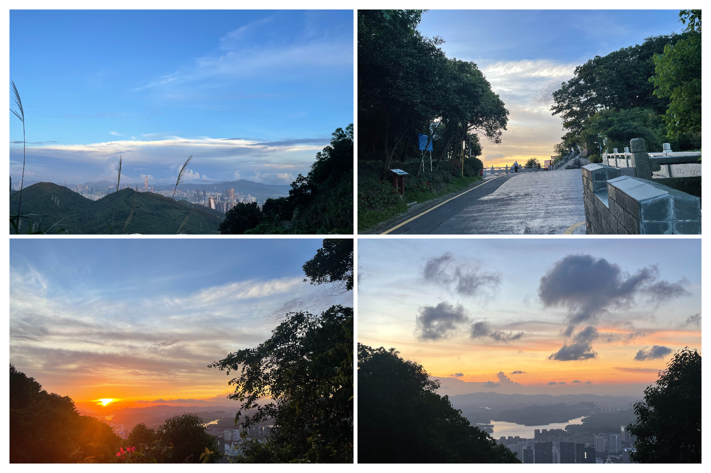

# 塘朗山---下班去追日落吗

## 概况

地点：深圳市区

* 时长：3小时以内来回
* 交通方式：公交、打车、自驾均可
* 消费参考：100以内（1人，交通）
* 体力消耗：中等
* 适合人群：身体健康均可
* 季节与天气：建议7～8月，深圳日落时间在19：10左右，六点下班的时候时间足够到山顶目送太阳下山，这个季节的夕阳也很好看
* 主要体验点：下班去追山顶的日落

## 体验点

### 1、下班去追山顶的日落

当我发现下班后去爬山能追上日落后，在枯燥的工作日又找到了一个新的乐子，前脚还在工位写代码，一个小时后就已经站在山顶吹着风目送太阳下山了。很难描述这是一种什么样的体验，大概就是大脑还没从工作的疲倦走出来，身边的美景却在不断提醒你：放轻松，你已经在另一个世界了，just enjoy life。

放几张近几天拍的照片吧，开阔的视野和绝美的夕阳日落足以让人的疲倦一扫而光。

<figure><figcaption>
都是在同一天拍的，山顶视野很开阔，可以看完日落再看看深圳城区的夜景
</figcaption></figure>

## 详细攻略

1. 打车前往“龙珠门入口”，7～8月的日落时间大概是19:10
   1. 如果你有运动基础，请预留半小时左右时间登山，即在6:40之前到达龙珠门入口
   2. 如果平时不怎么运动，请至少预留1小时登山，即在6:10之前到达龙珠门入口
2. 到达登山口后，一路沿着台阶向上即可，注意不要走大马路，会非常慢
3. 到达山顶看完日落后，有两种方式下山，最后都会回到最初的登山口
   1. 沿着原路台阶下山：比较快（约半小时内），但是没有路灯，台阶下山比较费膝盖，赶时间可以走台阶
   2. 走盘山公路下山：比较慢（一个半小时左右），路上有路灯，路相对比较平，不赶时间建议走盘山公路下山

## 拓展体验

* 到达山顶后从梅林水库下山，会走过一条从南山横穿到福田的路线，想挑战体力的可以尝试，后续会补上这部分攻略
* 银梅塘茶穿越：横穿银湖山-->梅林后山-->塘朗山-->茶光，几乎横穿整个深圳市区，详情请参考[这篇攻略](yin-mei-tang-cha-wei-wan-dai-xu-zai-shan-zhong-heng-chuan-shen-zhen-zhu-cheng.md)
