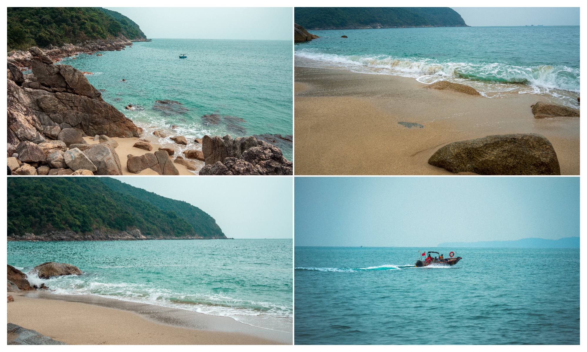
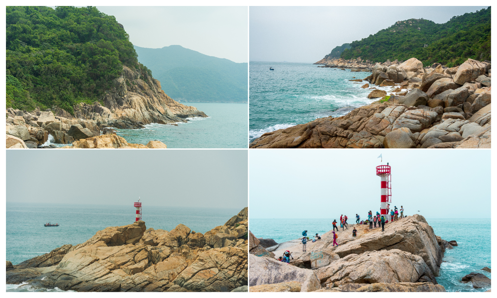
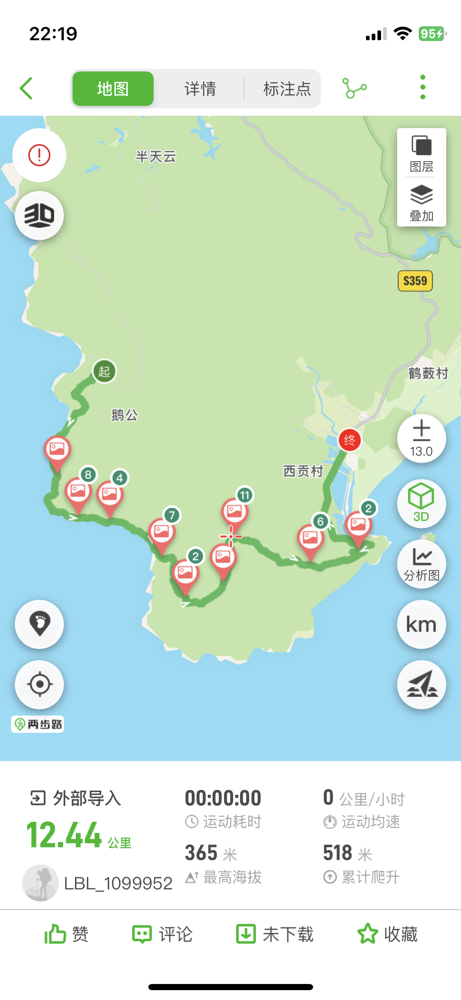
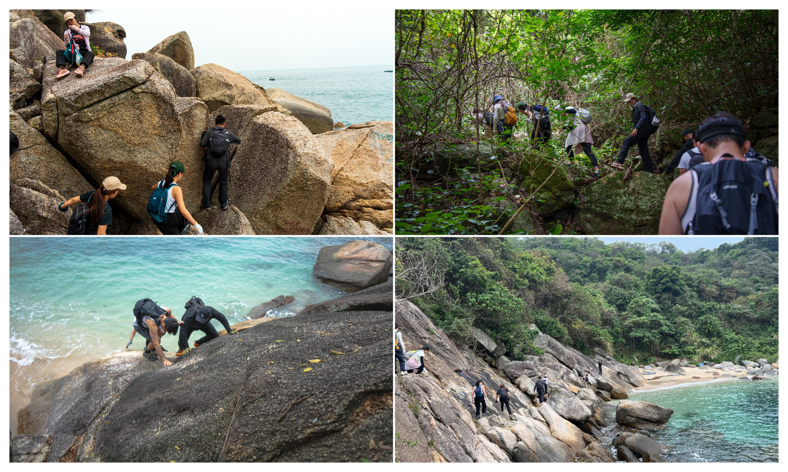
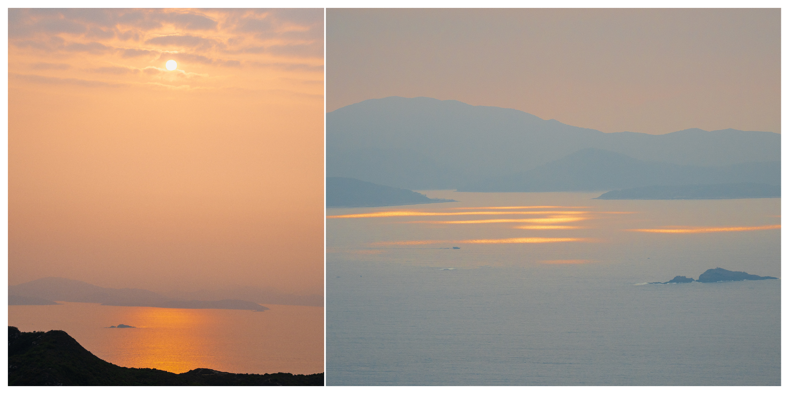

# 【大鹿港】最难走的路，最干净的海

## 概况

* 地点：深圳大鹏半岛
* 时长：9小时左右（徒步时间），一整个白天（深圳市区往返总时间）
* 交通方式：公交到南澳中心，后包车前往徒步起点
* 消费参考：100左右（1人，交通+吃饭）
* 体力消耗：5星
* 适合人群：有徒步基础
* 季节与天气：凉爽（防中暑）、较为晴朗的天气（下雨会有危险性）
* 主要体验点：绝美山海+海岸线、挑战自我、山顶日落

## 体验点

### 1、绝美山海+海岸线

大鹿港的风景整体类似于东西涌穿越，都是半山半海的美景，不过这边的人会更少一些，海水也会更干净，在穿越途中还会路过大鹿港灯塔，在这里拍照很好看，放几张队友用单反拍的美照～

<figure><figcaption>
这里的水和沙滩都特别干净
</figcaption></figure>

<figure><figcaption>
海岸线和灯塔，一路上的风景都很美
</figcaption></figure>

### 2、挑战自我

从徒步的角度来看，我们走的这条路线是穿越柚柑湾-->大鹿港-->头崖-->西涌，整条路线包括海岸线+溯溪+山脊线，整体难度较大（有的路线是从西贡村反向穿越，爬升会少很多，且没有溯溪简单很多）。这条路线的两步路轨迹如下图，爬升只有500多，但几乎有一半以上是溯溪而上，非常难走

<figure><figcaption>
看似简单，实则非常难走
</figcaption></figure>

海岸线的路上会经过各种大石头，有的地方会很高（恐高症十分不友好）；溯溪而上的路比海岸线更难走，各种青苔水坑，非常的滑；最后的山脊线和下山全程吊着一口气走完了，勉强在天黑的时候到达了山脚下，这大概是我最艰难的一次徒步。

<figure><figcaption>
全程需要很多攀爬，对体力和平衡能力要求很高
</figcaption></figure>

### 3、山顶日落

在我到达山顶的时候，已经没有力气来欣赏日落了，不过队友在山顶拍了一些美照，给大家分享一下～

<figure><figcaption>
右图是海上漂浮的金光，第一次亲眼所见的时候很惊艳
</figcaption></figure>

### 需要提前准备的

* 需要自带午餐，建议带点肉包子、饭团之类的，士力架之类的不建议
* 一双徒步登山鞋（迪卡侬¥399已经足够），防滑好的鞋子可以极大减少受伤的概率
* 一双手套，抓绳索的时候会舒服很多
* 适当的水，路上几乎无补给点

### 行程安排

* 对于徒步老司机，直接在两步路轨迹搜索“大鹿港”，选择一条喜欢的路线即可
* 对于徒步新手，不建议自行前往
