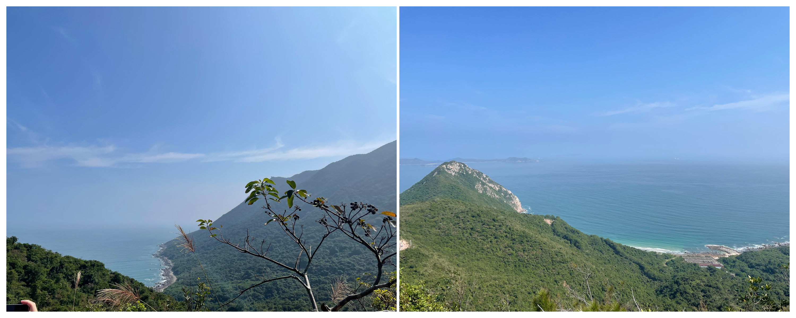
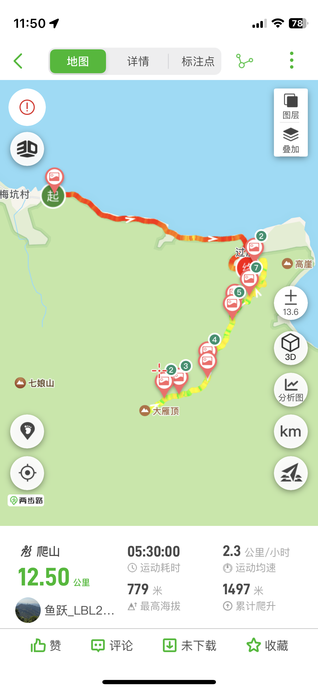

# 大雁顶---在大鹏第二高峰看海

## 概况

地点：深圳大鹏半岛

* 时长：7小时左右
* 交通方式：坐车到杨梅坑，然后坐摆渡车/快艇/步行经过沿海的鹿嘴大道前往登山口
* 消费参考：100左右（1人，交通+快艇票+小吃）
* 体力消耗：中等
* 适合人群：有运动基础的人
* 季节与天气：凉爽的季节（夏天容易中暑），晴空万里的天气（视野极好）
* 主要体验点：半山半海的最美观景台、挑战大鹏第二高峰

## 体验点

### 1、半山半海的最美观景台

大雁顶最好的风景在三号观景台上，视野非常开阔，可以看到半山半海的风景，也很适合拍照。（这里我只放风景照，那种美美的人照可以搜小红书“大雁顶三号观景台”）

<figure><figcaption>
左图是半山腰拍的，右图是三号观景台附近拍的
</figcaption></figure>

### 2、挑战大鹏第二高峰

从登山徒步的角度来看，大雁顶海拔800m，在大鹏半岛仅次于七娘山，从杨梅坑步行往返大雁顶总爬升约1500m，对体力是有一定考验的，喜欢运动的朋友不妨来挑战一下

<figure><figcaption>
两步路上找到的轨迹图
</figcaption></figure>

## 详细攻略

1. 坐车先到达“杨梅坑”
2. 从杨梅坑前往登山口，这里有三种方式
   1. 坐快艇：路上到处都有买票的，买完票到票贩子指定的码头上船前往即可，下船后导航搜索“鹿雁科考线”，步行前往即可
   2. 观光车：步行往绿道方向走（只有一条路很好找），绿道入口会有观光车售票点，买票上车即可，记得告诉司机在大雁顶入口下。若不小心坐过站，下车后导航搜索“鹿雁科考线”，步行前往就好不会太远。
   3. 步行（不太推荐）：直接导航搜索“鹿雁科考线”，然后步行前往，大约要走5km路，耗时一个小时。由于大雁顶本身比较消耗体力，不建议大家在前面步行消耗太多体力。
3. 到达登山口后一路向上即可，只有一条路不会迷路。如果体力不够无需登顶，三号观景台的风景已经是最漂亮，再往上性价比不高。
4. 爬完山原路返回
