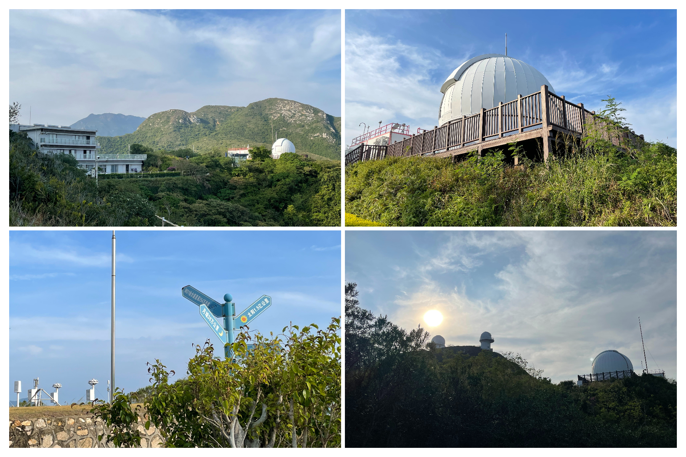

# 【东西涌穿越】穿越绝美海岸线

### 概况

* 地点：深圳大鹏半岛（东涌）
* 时长：一整个白天（当天往返，深圳市区出发）
* 交通方式：公交、打车、自驾均可
* 消费参考：100左右（1人，交通+吃饭）
* 体力消耗：4星
* 适合人群：有运动基础的人
* 季节与天气：夏天极易中暑，最好在10月-4月期间去
* 主要体验点：绝美山海+海岸线、挑战自我的成就感、在悬崖边听电吉他弹唱、近观天文台

## 体验点

### 1、绝美的海岸线

东西涌海岸线被《中国国家地理》评为中国最美八大海岸线之一，就个人体验来说确实很美，半山半海的景色实在令人心醉，在来之前我没想过在深圳这样的大都市还有这么原生态的山海，整个路上几乎没有商业化的痕迹，海水十分清澈。不多说了，上几张图片吧（iPhone 12mini 直出，亲眼所见会比照片好看许多），非常值得去亲身体验一下。

<figure><figcaption>
照片都是徒步路上随手一拍，无修图无滤镜，身临其境会更加震撼
</figcaption></figure>

### 2、挑战自我的成就感

这条路线并非旅游路线，而是一条原生态的徒步穿越路线，虽然是入门级的路线，但是对于没有徒步经验的人来说还是有不小的挑战。除了长时间徒步（约5小时左右）在体力上的挑战之外，路线也比较难走，需要在海岸线上的大礁石上爬上爬下，抓着绳索铁链上下悬崖等等。对于徒步小白来说，完整走完这条路线还是颇有成就感的。

<figure><figcaption>
大部分路都是左图的大石头，走起来要格外小心。会有几个右图这样的悬崖，需要抓着锁链下去
</figcaption></figure>

### 3、在悬崖边听电吉他弹唱

在徒步过程中，除了美景和沿途的补给点之外，最令我感动的就是悬崖边的弹唱歌手了。在精疲力尽的时候，顺着海风听见前方传来《海阔天空》的电吉他弹唱，或许只有身临其境才能体验到那种感动了，这也是整条路线中我最惊喜的一个点了，驻足听了很久才愿意接着往前走。当时在疫情期间快艇不能出海，歌手的设备都是用一块板子从海上漂过来的，属实有点浪漫了。

<figure><figcaption>
我们是沿着左图的海岸线走到右图的悬崖边，听到远处的歌声真的无比惊喜
</figcaption></figure>

### 4、近观深圳天文台

在东西涌穿越路线靠近西涌的终点会遇到深圳天文台栈道的起点，沿着栈道可以直接上到天文台，这条栈道的视野极好，一大片海尽收眼底。站在栈道上，无论是面向大海的开阔，还是面相天文台的山坡，或者是面向两侧的半山半海，景色都是极美的，我在去过一次之后一直念念不忘，后面又去了很多次。

<figure><figcaption>
站在栈道上，无论从哪个角度看，风景都是绝美的，站在这里吹海风的感觉十分让人沉醉
</figcaption></figure>

除了栈道的美景之外，对天文感兴趣的朋友也可以近观天文望远镜，好像有一点“红岸基地”的感觉？

<figure><figcaption>
右下角的图要是有个大雷达天线就很像红岸基地了
</figcaption></figure>

### 5、其他我还没体验的

* 西涌的天文台附近是暗夜保护区（没有光污染），据说晚上的星空很美
* 晚上附近会有萤火虫，运气好可以在西涌看到蓝眼泪

## 详细攻略

### 需要提前准备的

* 需要自带午餐，建议带点肉包子、饭团之类的，士力架之类的不建议
* 一双徒步登山鞋（迪卡侬¥399已经足够），防滑好的鞋子可以极大减少受伤的概率
* 一双手套，抓绳索的时候会舒服很多
* 适当的水，路上有补给点可以买，不用背太多

### 行程安排

* 对于徒步老司机，直接在两步路轨迹搜索“东西涌穿越”，乘车前往东涌起点即可，导航搜索：“东涌社区工作站”
* 对于徒步新手，不建议第一次自行前往，请直接找领队带路（美团或携程搜索：“东西涌穿越一日游”），跟随领队安排即可

## 拓展体验

暂无，东西涌穿越已经足够完整，让人心满意足。
