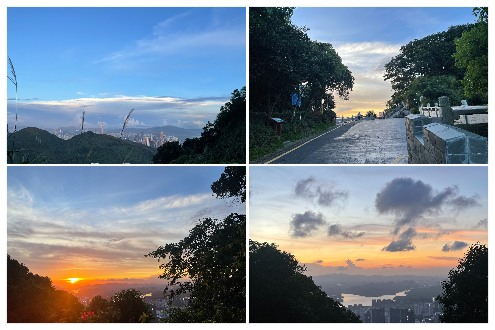

# 塘朗山---下班去追日落吗

## 概况

地点：深圳市区

* 时长：3小时以内来回
* 交通方式：公交、打车、自驾均可
* 消费参考：100以内（1人，交通）
* 体力消耗：中等
* 适合人群：身体健康均可
* 季节与天气：建议7～8月，深圳日落时间在19：10左右，六点下班的时候时间足够到山顶目送太阳下山，这个季节的夕阳也很好看
* 主要体验点：下班去追山顶的日落

## 体验点

### 1、下班去追山顶的日落

当我发现下班后去爬山能追上日落后，在枯燥的工作日又找到了一个新的乐子，前脚还在工位写代码，一个小时后就已经站在山顶吹着风目送太阳下山了。很难描述这是一种什么样的体验，大概就是大脑还没从工作的疲倦走出来，身边的美景却在不断提醒你：放轻松，你已经在另一个世界了，just enjoy life。

放几张近几天拍的照片吧，开阔的视野和绝美的夕阳日落足以让人的疲倦一扫而光。

<figure><figcaption>
都是在同一天拍的，山顶视野很开阔，可以看完日落再看看深圳城区的夜景
</figcaption></figure>

## 详细攻略

下午下班后直接打车到“龙珠门入口”，可以提前查阅当天的日落时间点（百度搜索深圳日落时间即可，时间很准）。例如19:10的日落，至少要在6:40之前到达龙珠门入口（爬上山顶至少预留半小时时间，不常运动的人最好预留一个小时）。到达龙珠门入口后一路沿着楼梯上山即可（注意不要走马路），看完日落可以一路沿着公路下山（台阶路晚上没有路灯，并且台阶路下山会比较伤膝盖），公路下山大约需要一个半小时的时间，从开始爬山到下山全程约3小时左右。
