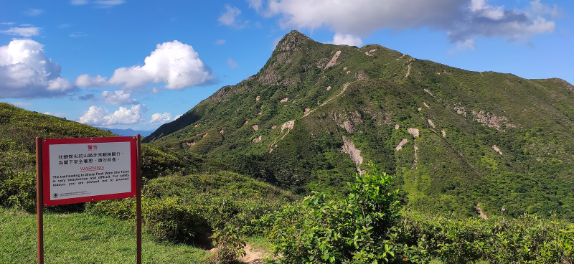

# 【蚺蛇尖】遥望“海角天涯”

### 概况

* 地点：香港
* 时长：9小时左右（徒步时间），一整个白天（深圳市区往返总时间）
* 交通方式：从福田口岸过关后坐港铁转香港大巴到起点
* 消费参考：200左右（1人，交通+小吃）
* 体力消耗：5星
* 适合人群：有运动基础
* 季节与天气：凉爽，视野好的时候
* 主要体验点：挑战香港“三尖”之首，独享一片沙滩，行走在插入海里的山脊上

### 体验点

### **1、挑战香港“三尖”之首+四大考牌路线之一**

“三尖”指的是香港三座比较尖的山峰，下面是维基百科的介绍：

香港三尖是香港三座尖削的山峰，现时为西贡的蚺蛇尖(468M)、清水湾的钓鱼翁(344M)及屯门的青山(583M)，因其海拔高而且地势陡峭，部分路段碎石满布，难以行走，故被合称为香港三尖。

● 西贡半岛蚺蛇尖

● 屯门青山

● 西贡钓鱼翁

过往的列表有时列入城门的针山代替钓鱼翁或青山，但最近20年至现时多数列入钓鱼翁及青山。

从远处的照片来看，确实都比较尖。。。

<figure><figcaption>
蚺蛇尖
</figcaption></figure>

<figure><figcaption>
屯门青山+西贡钓鱼翁
</figcaption></figure>

其实如果只看单座山的爬升的话，三尖都不算大，蚺蛇尖的难度在于整条路线上，这条路线也被称为“一尖三咀過四灣”，是香港四大考牌路线之一，下面是网上对四大考牌路线的介绍：

_香港行山界素來傳說有「四大考牌路線」，所謂考牌路線都是口耳相傳，歷史已不可考。「四大考牌路線」分別是「環湖出咀」、「一尖三咀過四灣」、「狗牙嶺三牙全走」及「杯靈雙渡」，四條路線的特色都是以非官方路線為主，路況較差、缺乏指示、路程長、補給少，而且四條路線都是瘋狂曝曬，能夠輕鬆完成四條路線可說是香港行山的小成就，考牌成功的朋友相信都有相當的基本功。_

<figure><figcaption>
「環湖出咀」（左上）、「一尖三咀過四灣」（右上）、「狗牙嶺三牙全走」（左下）及「杯靈雙渡」（右下）
</figcaption></figure>

从整条路线来看，「一尖三咀過四灣」全程的距离还是比较长的（26km），爬升不算特别多（1000左右），路线以公路+树林+山脊线为主，还会路过几个人很少的沙滩，非常漂亮

<figure><figcaption></figcaption></figure>

### **2、独享一片沙滩**

前往蚺蛇尖的路上，会路过好几个沙滩，大概因为前往这几个沙滩的路都比较艰难，几乎都没有人（只会有很少几个坐游艇来的）

<figure><figcaption>
队友航拍的沙滩，很大一片又很干净
</figcaption></figure>

<figure><figcaption>
行走在一片孤独的沙滩上
</figcaption></figure>

### **3、行走在插入海里的山脊上**

从航拍视角，自东向西看，前往蚺蛇尖的路线就像是直插入海里的一条山脊线，十分的壮观，靠近海的前段颇有一种“海角天涯”的感觉。

<figure><figcaption>
从队友航拍视频截的图，左上角最高的尖就是蚺蛇尖
</figcaption></figure>

<figure><figcaption>
从反方向的视角望去，像是在天涯海角，走在这样的山脊上很有与世隔绝的感觉
</figcaption></figure>

<figure><figcaption>
两个不同的视角，左图最远处其实是深圳的大鹏半岛
</figcaption></figure>

### 详细攻略

#### **需要提前准备的**

● 港澳通行证+签证+香港流量包（淘宝直接买）+支付宝的香港乘车码

● 登山鞋+登山杖+饮用水（香港的比较贵建议在深圳买，路上有补给）

● 两步路app搜索“蚺蛇尖”，提前预习并将轨迹导入手机，[这条轨迹](https://www.2bulu.com/track/t-vAdcBRCvkUXp%2FR2KBg5Tzw%3D%3D.htm;jsessionid=EB8372D6BA2551A5C788BDD17E8F68C3-n1)供参考（不建议新手自行前往）

#### **行程安排**

1\.  在福田口岸过关后乘坐港铁，在“沙田市中心”转乘大巴289，在“鲫鱼湖”下车

2\.  沿着提前导入的轨迹前行即可，下山后在“北谭凹”乘坐大巴289返程，同样在“沙田市中心”转乘港铁回到福田口岸
