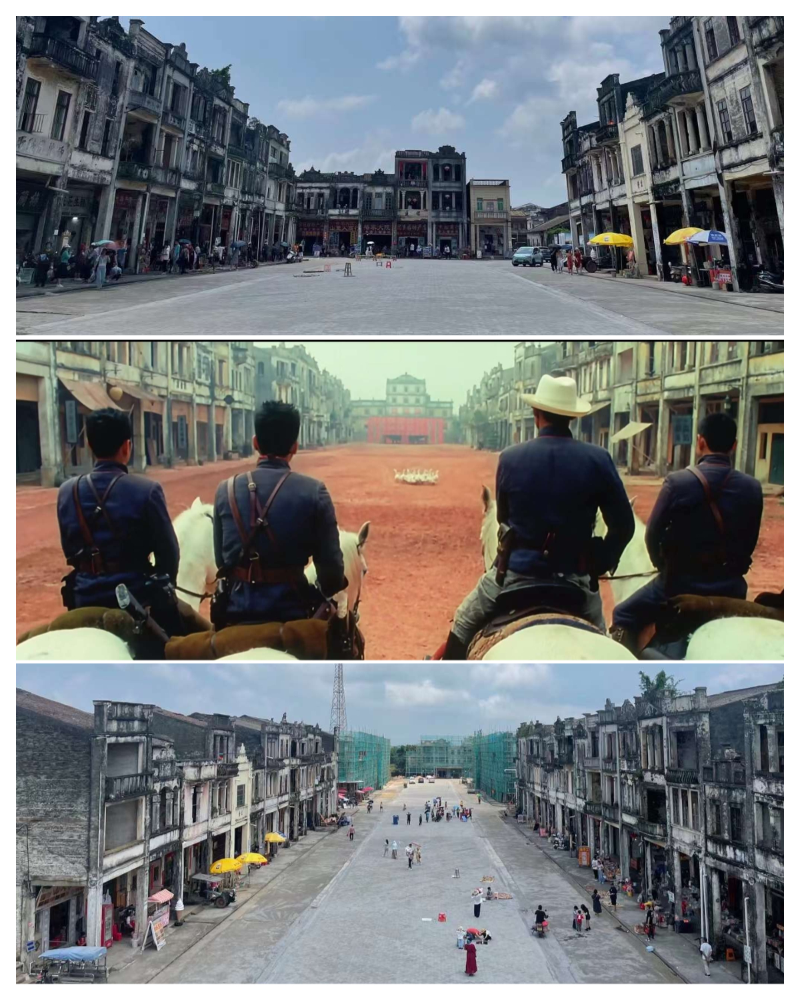

# 梅家大院---《让子弹飞》的鹅城

## 概况

地点：江门

* 时长：1小时左右
* 交通方式：坐车/开车均可
* 消费参考：100以内（1人，交通+小吃）
* 体力消耗：休闲
* 适合人群：朋友同学、情侣出行
* 季节与天气：推荐凉快一点的时候
* 主要体验点：身临“鹅城”

## 体验点

### 1、身临“鹅城”

其实整个地方很小，一下就逛完了，专门跑过来看一眼可能会有一点失望，但是作为看了很多遍《让子弹飞》的影迷，来这里看一眼也算是圆梦了。现在整个大院的变化也挺大的，有的地方也还在装修，其实很难找到《让子弹飞》里面一模一样的场景了，我拍了个对比图供大家参考～

<figure><figcaption>
十余年过去，几乎找不到原片里面的感觉了
</figcaption></figure>

## 详细攻略

1. 坐车、或开车直接导航到“梅家大院”即可（周围很空旷，停车的地方很多）
