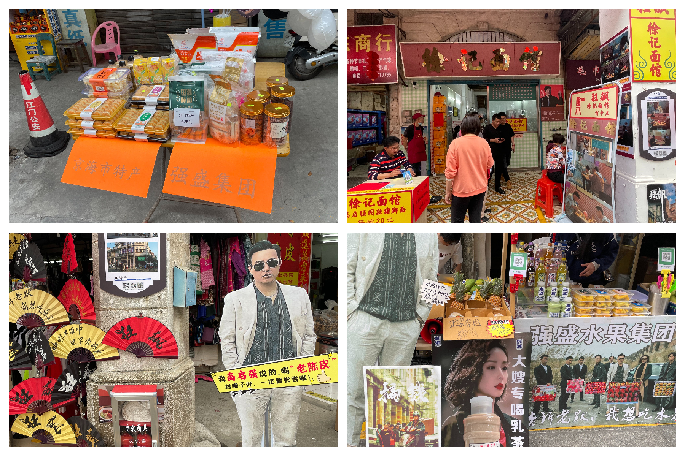

# 【三十三墟街】身临《狂飙》旧厂街

## 概况

* 地点：江门
* 时长：一整个下午（中山市区出发）
* 交通方式：坐车/开车均可
* 消费参考：100以内（1人，交通+小吃）
* 体力消耗：1星
* 适合人群：朋友同学、情侣出行（建议看过《狂飙》后再来）
* 季节与天气：推荐凉快一点的时候
* 主要体验点：走进《狂飙》的世界

## 体验点

### 1、身临《狂飙》拍摄地

《狂飙》可以说是前段时间比较火的电视剧了，偶然发现拍摄地就在江门，去了之后印象最深刻的就是各个商家的整活了，拍了一些照片各位自己感受下，总而言之挺有趣的～

<figure><figcaption>
强哥买等离子电视的地方
</figcaption></figure>

商家为了卖自己的小吃和特产，真的是想尽办法在整活了，随处可见剧里的各种梗，很有趣的体验

<figure><figcaption>
告诉老默，我想吃水果了
</figcaption></figure>

## 详细攻略

1. 坐车、或开车直接导航到“三十三墟街”即可（注意周围可能人比较多，也比较堵车，难找停车位，可以停在附近然后步行过去）
