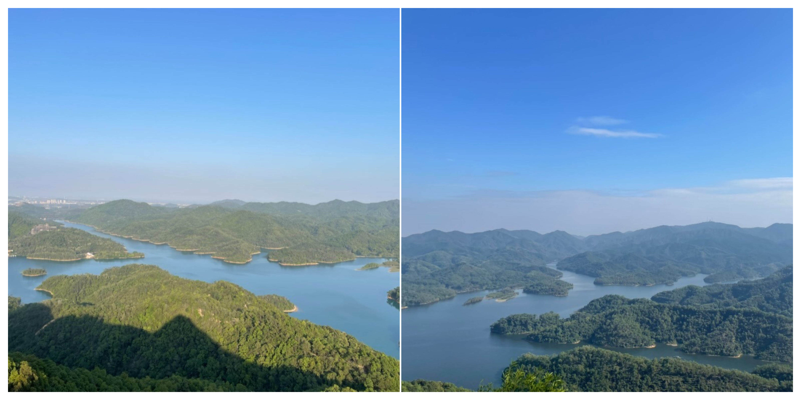
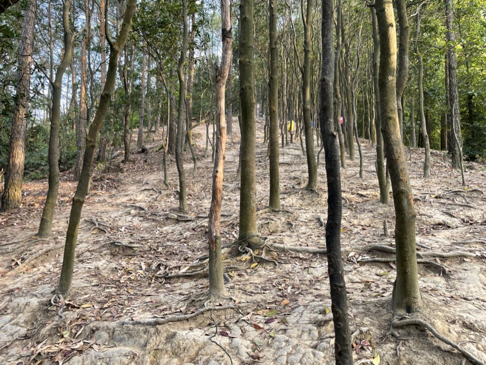

# 狮头山---小千岛湖

## 概况

地点：中山

* 时长：4小时左右
* 交通方式：自驾到登山口
* 消费参考：100以内（1人，交通+小吃）
* 体力消耗：中等
* 适合人群：有运动基础
* 季节与天气：凉快的时候
* 主要体验点：山顶俯瞰小千岛湖、树林中的爬升

## 体验点

### 1、山顶俯瞰小千岛湖

登上狮头山顶，可以俯瞰到一片很像千岛湖的景观，在中山市区可以看到这样的景观还是挺意外的，如果在附近的话值得来看一眼（下面是中山的长江水库）

<figure><figcaption></figcaption></figure>

### 2、树林中的爬升

这段登山的路挺有特点的，需要穿过光秃秃的树林，放张照片大家感受一下，我个人挺喜欢这样的登山路

<figure><figcaption>
很长一段路都是这样的，在别的地方很少见这样的登山路
</figcaption></figure>

## 详细攻略

1. 坐车、或开车直接导航到“狮头山上山路口”即可（周围停车很方便）
2. 一路跟随人群向上走即可，到达山顶后原路返回
