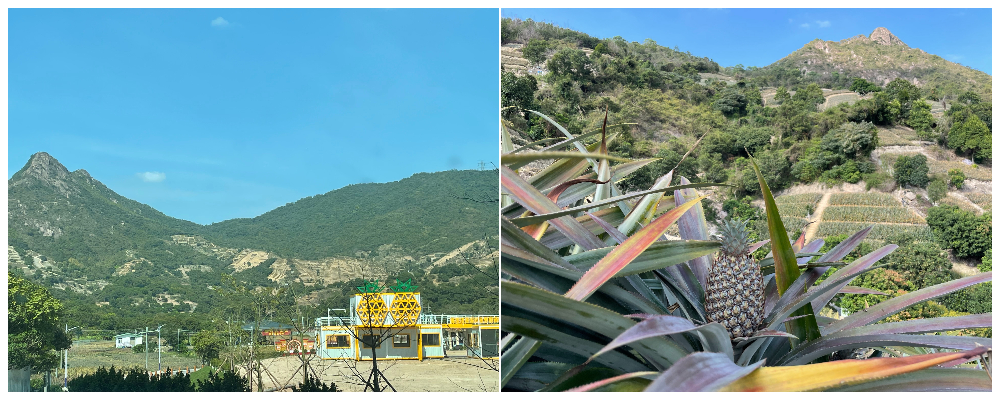
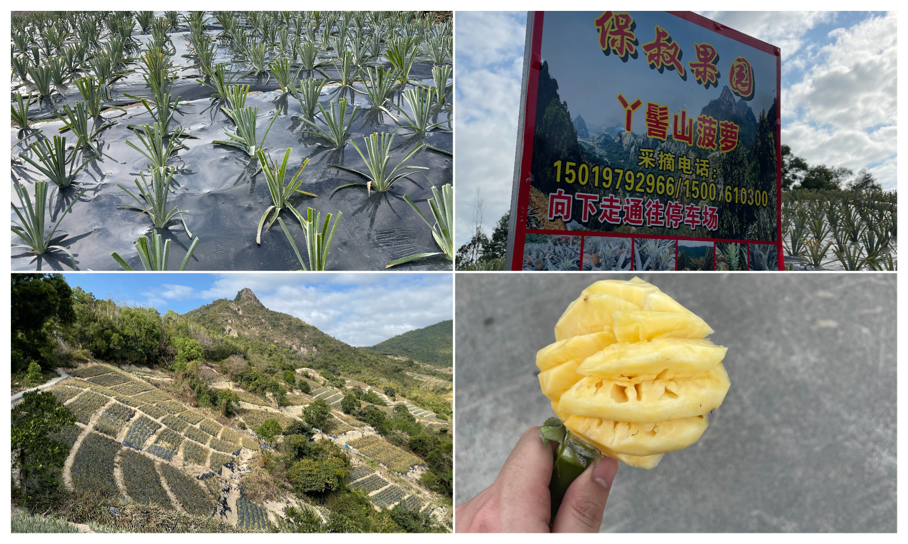
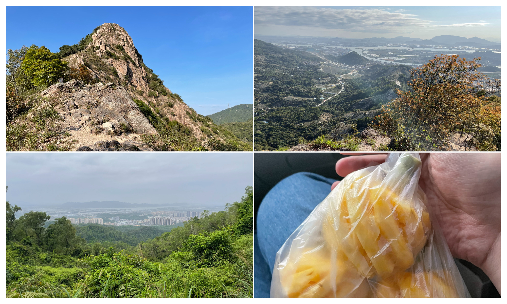

# 【丫髻山】满山都是菠萝

## 概况

* 地点：中山
* 时长：3小时左右（游玩时间），一整个下午（中山市区往返）
* 交通方式：自驾到山脚下
* 消费参考：100以内（1人，交通+小吃）
* 体力消耗：2星
* 适合人群：爱吃菠萝的人
* 季节与天气：凉爽的时候
* 主要体验点：在种满菠萝的山上吃菠萝、徒步爬山

## 体验点

### 1、在种满菠萝的山上吃菠萝

其实这里不算一个景点，更像是一个菠萝种植园区，对于不爱吃菠萝的人来说可能略显无聊，但我作为一个很爱吃菠萝的人，来到这里看到漫山遍野的菠萝还是很心动

<figure><figcaption>
进来看到房子上都是菠萝装饰，再走近一点就看到漫山遍野的菠萝了
</figcaption></figure>

这里的菠萝是可以自己来采摘的，来的时候看到很多人带娃来摘菠萝的，好像也是一种不错的亲子室外活动项目hhh（到处也有卖小菠萝的，拿在手上啃是真爽）

<figure><figcaption>
有大菠萝也有小菠萝
</figcaption></figure>

### 2、徒步爬山

这里的山不算高，但视野还不错比较开阔，风景一般般（据说日落很好看，但我们没等到日落的时间），如果来了建议可以去走走，爬完山再打包几个小菠萝回去吃也很快乐hhhh

<figure><figcaption></figcaption></figure>

## 详细攻略

1. 坐车、或开车直接导航到“丫髻山公园”即可（周围停车很方便）
2. 一路跟随人群向上走，到达山顶后原路返回
