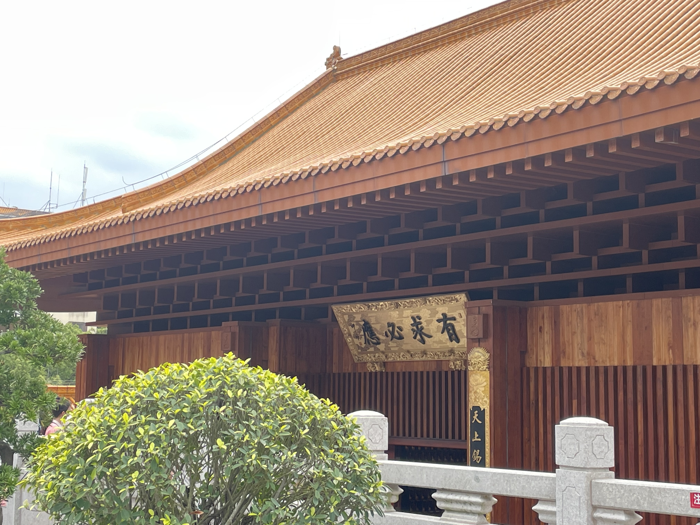
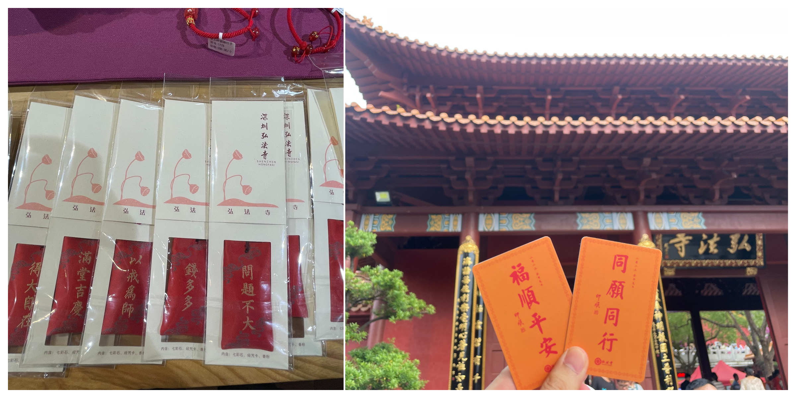
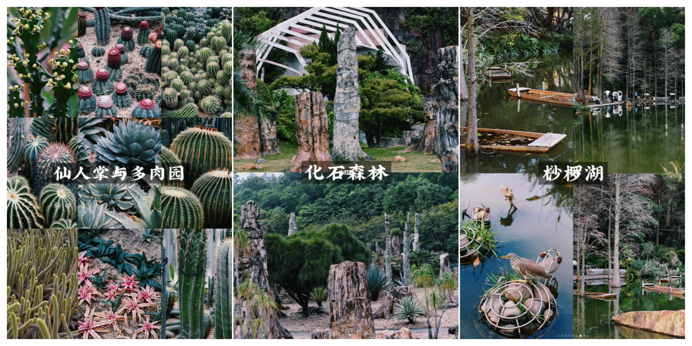

# 弘法寺---号称“有求必应”

## 祝大家概况

地点：深圳罗湖

* 时长：3小时左右
* 交通方式：坐车/开车均可
* 消费参考：100以内（1人，交通+小吃）
* 体力消耗：休闲
* 适合人群：带小孩、长辈、情侣朋友出行
* 季节与天气：看个人喜好
* 主要体验点：寺庙文化与祈福、植物园看花

## 体验点

### 1、寺庙文化与祈福

身临其境还是能感受到很浓的佛教文化，不过个人不是佛教信徒，认知比较浅薄，这里放一段弘法寺的网上介绍吧：

_弘法寺位于中国广东省深圳市罗湖区仙湖植物园内，背靠梧桐山，是一座汉传佛教寺院\[1]\[1]。弘法寺选址所在地被称之为“深圳绿色心肺”，1985年7月1日动土起造，是中华人民共和国建立以来国内新建的首座寺院。现任方丈为释印顺。弘法寺是中国佛教协会直属寺院之一。_

_每年农历的正月初一和十五，弘法寺香火都非常兴旺，致使每次都需要警方出动大量警力以维持秩序。1984年，深圳市政府邀请释本焕从丹霞山到深圳梧桐山共谋筹建弘法寺。1985年7月1日，弘法寺破土动工；释本焕从丹霞山别传寺率领十位弟子到梧桐山为弘法寺动土洒净。_

_弘法寺寺坐东南，朝西北，依山拾级而建。建筑面积三万余平方米。沿中轴线自下而上建有：山门殿、天王殿、佛教文化展览楼、大雄宝殿、藏经楼。两边及侧面分别建有客堂、祖师殿、伽蓝殿、钟鼓楼、观音殿、地藏殿、功德堂、方丈楼、退居楼、卧佛殿、斋堂、禅院、僧寮、客寮、云水堂等。_

让我印象最深刻的，就是这块“有求必应”的牌子

<figure><figcaption>
有需求的朋友可以来试试
</figcaption></figure>

寺庙里面还有很多卖祈福物件的地方，各种有趣的小东西，价格小贵。也有免费的小卡片可以在自助机器上扫二维码领取。（商店的工作人员很多是来做义工的人，时间是一周左右，有兴趣的朋友可以找时间去体验一下～）

<figure><figcaption>
祝大家都能福顺平安
</figcaption></figure>

### 2、植物园看花

弘法寺位于仙湖植物园里面最深处，在前往弘法寺的路上会从仙湖植物园穿过，一路上会有各种花花草草，感兴趣的朋友可以多逛逛，我去的那天人比较多就没怎么逛，也没拍照片了，放几张网上的照片大家参考下

<figure><figcaption>
看上去还是不错的，天气好的时候可以多逛下
</figcaption></figure>

## 详细攻略

TODO
