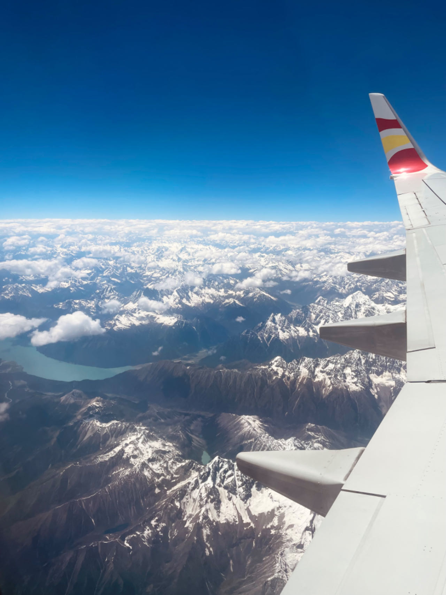

# 出发---注意事项

*   **交通方式**：建议乘坐**飞机**

    * 飞机时间短，有更多的时间游玩、休息；
    * 飞机抵达拉萨后，遇到高反有更有效的医疗措施；
    * 火车沿途海拔并不低，特别是翻越唐古拉山口那一段，海拔将近5000米（拉萨市区海拔仅3600米）；

    <figure><figcaption>
飞机上还可以俯视青藏高原的连绵雪山
</figcaption></figure>
* **拉萨概况**：经过多年的发展，拉萨已经有很多基础设施和服务了，包括医院、公交线路、各种商店和餐馆（甚至有万达广场），不需要担心在拉萨资源稀缺、停水停电、交通困难等问题。
* **关于高反**
  * 高反的**症状**其实跟酒醉差不多，轻度高反的症状是头晕，中度高反的症状是头昏眼花、手指发紫、消化不良、耳鸣头疼等（希望大家都体验不到这些症状）；
  * 治疗高反最有效的方法就是**吸氧**，但是为了更好地适应高原环境和防止醉氧，建议在高反症状不严重时，每吸氧五分钟就停下来，等到再次高反再吸氧；拉萨市区有很多供氧的酒店，价格比普通酒店贵几十块钱，建议到拉萨的第一天住供氧酒店；
  * 治疗高反还可以在拉萨的诊所买**高反药**，我当时在酒店楼下的诊所买了几包，感觉效果显著（不过最有效的方法还是吸氧）；
