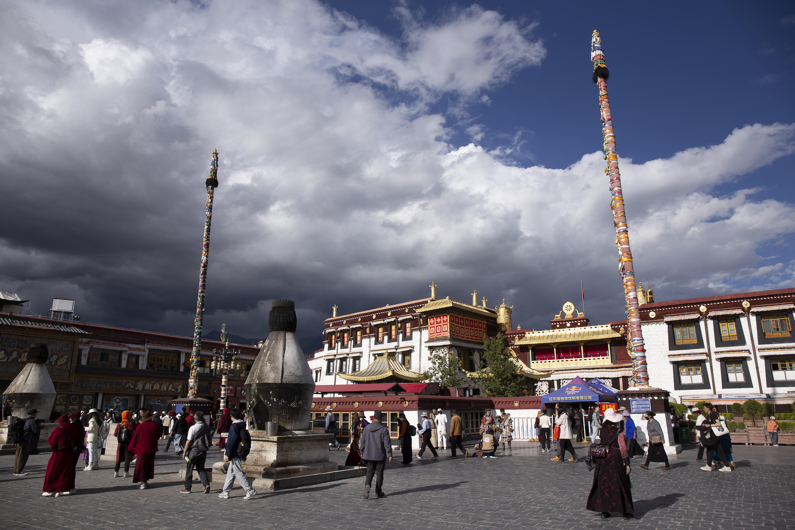

# 大昭寺---拉萨的信仰中心

**开放时间**：**8:00**\~**18:00**（不建议上午去，因为上午人非常多）

**门票价**：**80**元（根据季节变化）

（需提前一天在“大昭寺官方预约”小程序预约，预约开放时间：**7:00**）

**注意事项**：大昭寺在八廓街进出八廓街需要过安检和查身份证

## 为什么推荐大昭寺

抵达拉萨之前，我只知道布达拉宫（毕竟印在50元纸币上），但是在拉萨游玩一圈之后，我认为大昭寺才是最值得一去的。

在布达拉宫的时候，我的感觉就像在游览故宫，虽然也见到了香火和僧人，但总觉得离我非常遥远。

<figure><figcaption>
大昭寺前的广场
</figcaption></figure>

而与布达拉宫的高高在上不同，参拜大昭寺的更多是平民百姓，作为游客可以零距离见识到藏区百姓对信仰的高度虔诚。特别是看到藏民绕着大昭寺磕长头的时候，感觉心里有一根弦被拨动了。

<figure><figcaption>
大昭寺旁，八廓街的藏族人民和佛教徒
</figcaption></figure>

<figure><figcaption>
大昭寺门前磕长头的藏族人民
</figcaption></figure>

并且，大昭寺内部可以见到的佛像数量众多、姿态各异，而且可以近距离观察。可惜寺内不让拍摄，所以这里就没有配图。（还看到一些[**密宗双修**](https://zh.wikipedia.org/zh-hans/%E9%9B%99%E8%BA%AB%E6%B3%95)佛像，涨知识了）

