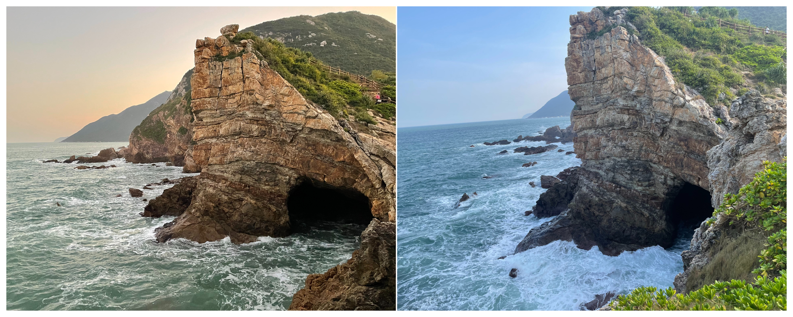
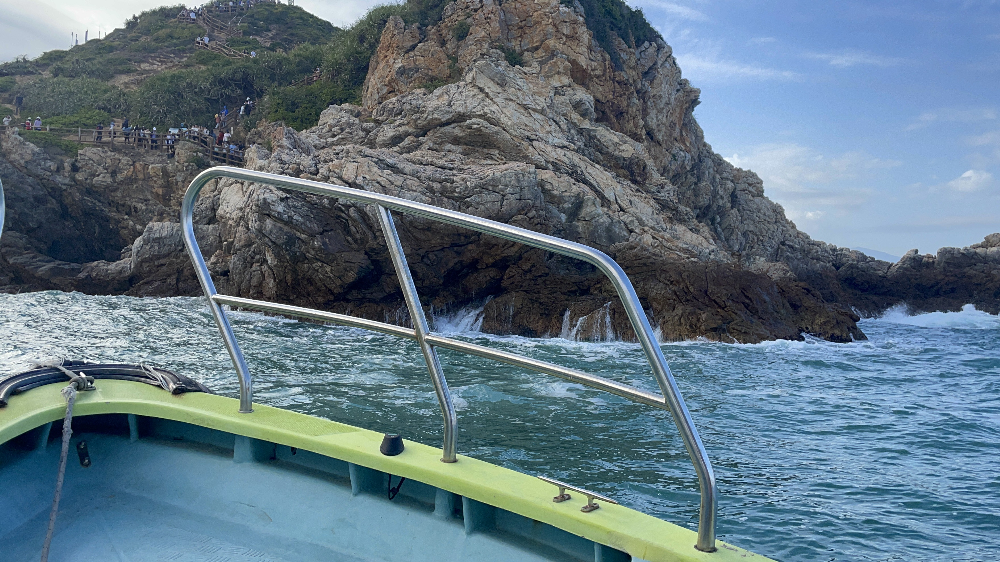
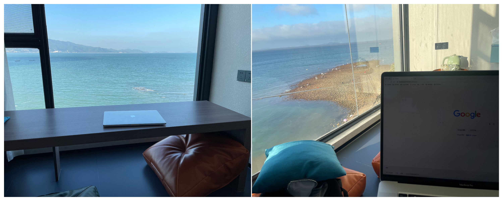

# 鹿嘴山庄---《美人鱼》的人鱼洞

海边概况

地点：深圳大鹏半岛

* 时长：2小时左右
* 交通方式：坐车到杨梅坑，然后坐摆渡车/快艇/步行到鹿嘴山庄
* 消费参考：100左右（1人，交通+快艇票+小吃）
* 体力消耗：休闲
* 适合人群：带长辈、情侣朋友出行（适合拍照）
* 季节与天气：晴空万里的天气（视野极好）
* 主要体验点：面朝大海的海边悬崖、《美人鱼》中的人鱼洞、海滨绿道、海上快艇、海景民宿

## 体验点

### 1、面朝大海的海边悬崖

站在鹿嘴山庄的悬崖边，可以望到对面一望无际的大海，视野非常开阔。站在悬崖边听着海水拍打礁石的声音，遥望着一望无际的大海，可以让整个人都放松下来。

<figure><figcaption>
海边喝椰子，太舒服
</figcaption></figure>

### 2、《美人鱼》中的人鱼洞

这里是周星驰《美人鱼》电影中人鱼洞的取景地，现在是个比较网红的景点，推荐大家没来过的话可以来看一眼，还是非常漂亮的

<figure><figcaption>
左边是傍晚来拍的，右边是白天来拍的
</figcaption></figure>

### 3、海滨绿道

从杨梅坑前往鹿嘴山庄会经过一条绿道，是去年底才刚刚修好的，目前只能景区的观光车和步行通过，如果时间体力充足的话建议走走看（全长5km，需要走1小时左右），一路看看海也不错～

<figure><figcaption>
有很多路口可以下去到海边，很适合慢慢散步
</figcaption></figure>

### 4、海上快艇

如果不想走路前往的话，可以坐快艇，个人觉得海上快艇还是很值得体验一下的，很刺激，一路的风景也不错

<figure><figcaption></figcaption></figure>

### 5、海景民宿

如果想在这边多玩一下的话，建议可以在杨梅坑找个民宿住一下（图中的民宿周五晚约¥500+），这样会比较休闲一点，停车也会方便许多，并且可以早起多在大鹏半岛玩一些地方。（曾经在海景民宿面朝大海写过代码，也是很神奇的体验了

<figure><figcaption>
两次在这里住都是带了电脑来的。。。
</figcaption></figure>

## 详细攻略

TODO
