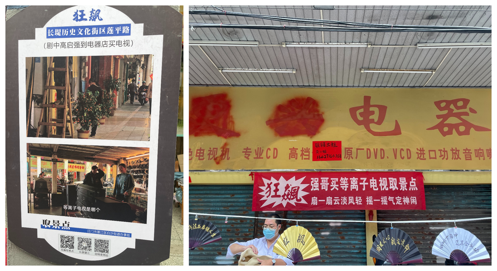
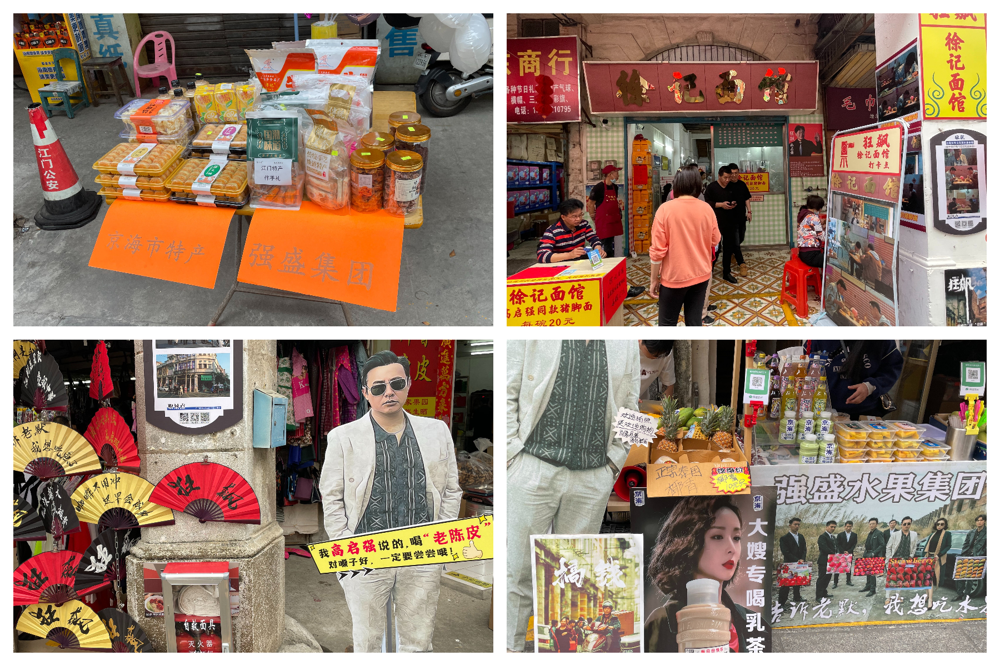

# 三十三墟街---《狂飙》拍摄地

概况

地点：江门

* 时长：3小时左右
* 交通方式：坐车/开车均可
* 消费参考：100以内（1人，交通+小吃）
* 体力消耗：休闲
* 适合人群：朋友同学、情侣出行
* 季节与天气：推荐凉快一点的时候
* 主要体验点：身临《狂飙》拍摄地

## 体验点

### 1、身临《狂飙》拍摄地

《狂飙》可以说是前段时间比较火的电视剧了，偶然发现拍摄地就在江门，去了之后印象最深刻的就是各个商家的整活了，拍了一些照片各位自己感受下，总而言之挺有趣的～

<figure><figcaption>
强哥买等离子电视的地方
</figcaption></figure>

商家为了卖自己的小吃和特产，真的是想尽办法在整活了，随处可见剧里的各种梗，很有趣的体验

<figure><figcaption>
告诉老默，我想吃水果了
</figcaption></figure>

