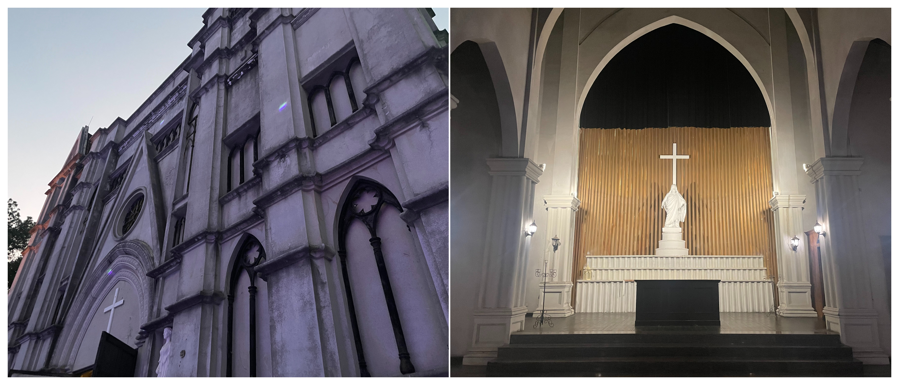

# 中山影视城---换装拍照的好地方

## 概况

地点：中山

* 时长：4小时左右
* 交通方式：坐车/开车均可
* 消费参考：300以内（1人，交通+小吃+门票）
* 体力消耗：休闲
* 适合人群：情侣出行、闺蜜约拍照、带娃带长辈
* 季节与天气：推荐凉快一点的时候，最好傍晚去（可以在白天和晚上拍照，夜晚的灯光很好看）
* 主要体验点：换装拍美照

## 体验点

### 1、换装拍美照

在影视城最适合的事情就是换装拍照了，在一个影视城里面集合了很多不同风格特色的建筑，可以在一个地方拍出很多不同风格的照片，里面有很多租赁服装的地方，非常适合女生来拍艺术照（很多带着单反来给妹子拍照的），随手拍了一点照片供参考，更多的美照可以在小红书上搜一下～

<figure><figcaption>
西式的教堂
</figcaption></figure>

<figure><figcaption>
中式古风的街道
</figcaption></figure>

<figure><figcaption>
美式唐人街和日式的庭院
</figcaption></figure>
